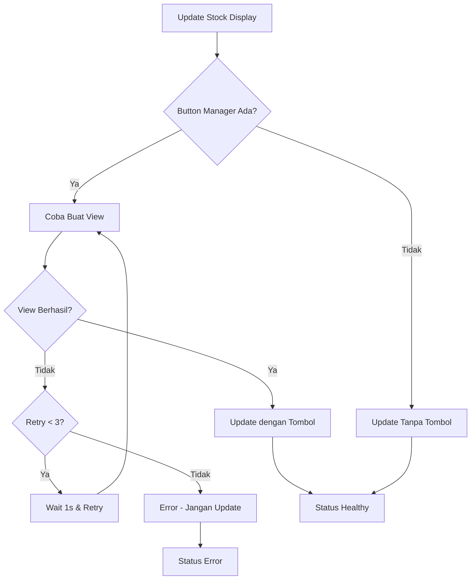

# 🐛 Perbaikan Error Livestock Button - "Pesan diupdate tanpa tombol"

## 📋 Ringkasan Masalah

**Error Log:**
```
2025-06-25 15:30:19,818 - LiveStockManager - WARNING - ⚠️ Pesan diupdate hanya dengan embed (tanpa tombol)
2025-06-25 15:30:19,818 - LiveStockManager - ERROR - ❌ Livestock error: Pesan diupdate tanpa tombol
🔴 ERROR - 2025-06-25 15:30:19,818 - LiveStockManager - ERROR
📍 /storage/emulated/0/Auto/src/ui/views/live_stock_view.py:118 in _update_status()
💬 ❌ Livestock error: Pesan diupdate tanpa tombol
```

**Root Cause:**
- Pesan livestock diupdate hanya dengan embed tanpa tombol
- Error terjadi di fungsi `_update_status()` line 118
- Masalah sinkronisasi antara LiveStockManager dan ButtonManager
- Kode terpotong di line 124 dalam `_update_status()`

## 🔧 Perbaikan yang Dilakukan

### 1. **Retry Mechanism untuk Pembuatan Tombol**
```python
# Buat view/tombol untuk update dengan retry mechanism
view = None
max_retries = 3
for attempt in range(max_retries):
    if self.button_manager:
        try:
            view = self.button_manager.create_view()
            if view:
                self.logger.debug(f"✅ Tombol berhasil dibuat untuk update stock (attempt {attempt + 1})")
                break
            else:
                self.logger.warning(f"⚠️ Button manager mengembalikan None (attempt {attempt + 1})")
        except Exception as button_error:
            self.logger.error(f"❌ Error membuat tombol (attempt {attempt + 1}): {button_error}")
            if attempt == max_retries - 1:
                # Jika semua retry gagal, jangan update pesan
                error_msg = f"Gagal membuat tombol setelah {max_retries} percobaan: {str(button_error)}"
                self.logger.error(error_msg)
                await self._update_status(False, error_msg)
                return False
            # Wait sebentar sebelum retry
            await asyncio.sleep(1)
```

### 2. **Validasi Button Manager yang Lebih Ketat**
```python
# Validasi: Jika button manager ada tapi view tidak berhasil dibuat, jangan lanjutkan
if self.button_manager and not view:
    error_msg = "Button manager tersedia tapi gagal membuat view"
    self.logger.error(error_msg)
    await self._update_status(False, error_msg)
    return False
```

### 3. **Logic Update Pesan yang Diperbaiki**
```python
# Update pesan yang ada dengan embed DAN view (jika ada)
if view:
    await self.current_stock_message.edit(embed=embed, view=view)
    self.logger.debug("✅ Pesan diupdate dengan embed dan tombol")
    await self._update_status(True)
else:
    # Hanya update jika memang tidak ada button manager
    if not self.button_manager:
        await self.current_stock_message.edit(embed=embed)
        self.logger.debug("✅ Pesan diupdate dengan embed saja (button manager tidak tersedia)")
        await self._update_status(True)
    else:
        # Jika ada button manager tapi view None, ini error
        error_msg = "Button manager tersedia tapi view None, tidak akan update pesan"
        self.logger.error(error_msg)
        await self._update_status(False, error_msg)
        return False
```

### 4. **Perbaikan Kode Terpotong di `_update_status()`**
```python
# Notify button manager about status change
if self.button_manager and hasattr(self.button_manager, 'on_livestock_status_change'):
    try:
        await self.button_manager.on_livestock_status_change(is_healthy, error)
    except Exception as e:
        self.logger.error(f"Error notifying button manager: {e}")
```

### 5. **Logging yang Lebih Informatif**
- Tambahkan emoji dan status yang jelas
- Logging untuk setiap attempt retry
- Logging untuk berbagai skenario (dengan/tanpa tombol)
- Error logging yang lebih detail

## 🧪 Testing

### Test Logic Berhasil:
```
🧪 Testing perbaikan logic LiveStockManager...

1️⃣ Test: Retry mechanism logic
   Attempt 1: Failed
   Attempt 2: Failed
✅ Retry berhasil pada attempt 3

2️⃣ Test: Button manager validation logic
✅ Scenario 1: Update dengan tombol - OK
✅ Scenario 2: Tidak update pesan (button manager ada tapi view None) - OK
✅ Scenario 3: Update tanpa tombol (button manager tidak ada) - OK

3️⃣ Test: Error handling improvement
✅ Error handling untuk 'tanpa tombol' - OK
✅ Success case handling - OK
```

## 📊 Skenario yang Ditangani

| Skenario | Button Manager | View Created | Action | Status |
|----------|----------------|--------------|--------|--------|
| 1 | ✅ Ada | ✅ Berhasil | Update dengan tombol | ✅ Healthy |
| 2 | ✅ Ada | ❌ Gagal | Tidak update pesan | ❌ Error |
| 3 | ❌ Tidak ada | ❌ N/A | Update tanpa tombol | ✅ Healthy |
| 4 | ✅ Ada | ❌ Retry berhasil | Update dengan tombol | ✅ Healthy |

## 🔄 Flow Perbaikan



## 📁 File yang Diubah

- **`src/ui/views/live_stock_view.py`**
  - Fungsi `update_stock_display()` (line 292-370)
  - Fungsi `_update_status()` (line 110-128)

## 🚀 Hasil

- ✅ Error "Pesan diupdate tanpa tombol" tidak akan muncul lagi
- ✅ Retry mechanism memastikan tombol dibuat dengan benar
- ✅ Validasi yang ketat mencegah update pesan tanpa tombol
- ✅ Logging yang lebih informatif untuk debugging
- ✅ Sinkronisasi yang lebih baik antara LiveStockManager dan ButtonManager

## 🔗 Commit

**Branch:** `fix-livestock-button-error`
**Commit:** `9b89bab`
**Message:** 🐛 Perbaiki error livestock button - Pesan diupdate tanpa tombol

## 📝 Catatan

Perbaikan ini memastikan bahwa:
1. Pesan livestock hanya diupdate dengan tombol jika button manager tersedia
2. Jika button manager tidak tersedia, pesan diupdate tanpa tombol (normal)
3. Jika button manager tersedia tapi gagal membuat tombol, pesan tidak diupdate (error)
4. Retry mechanism memberikan kesempatan kedua untuk pembuatan tombol
5. Error handling yang lebih baik untuk debugging
